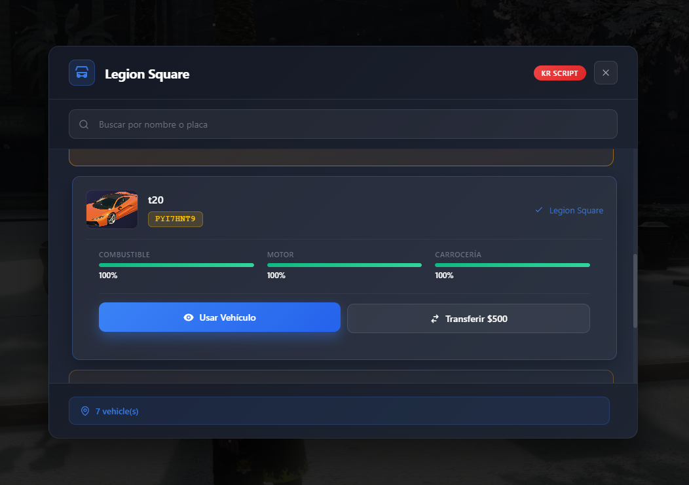
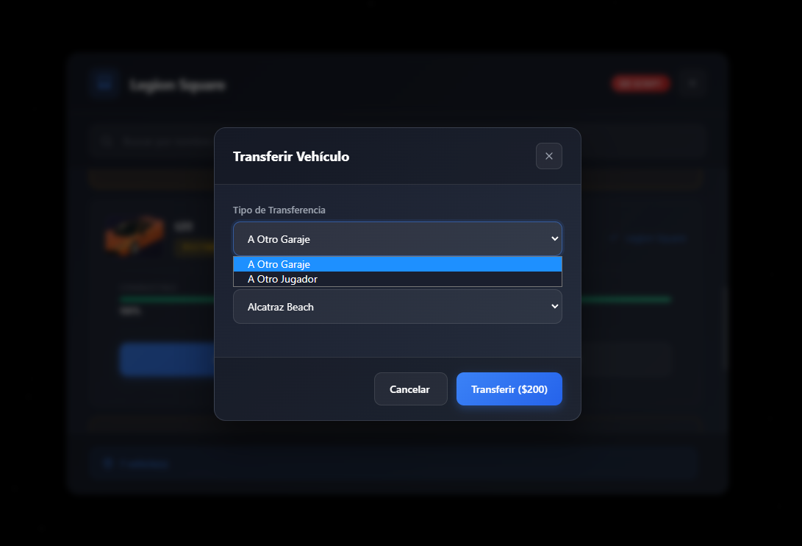
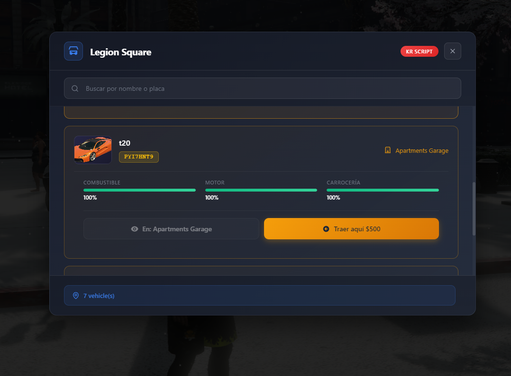
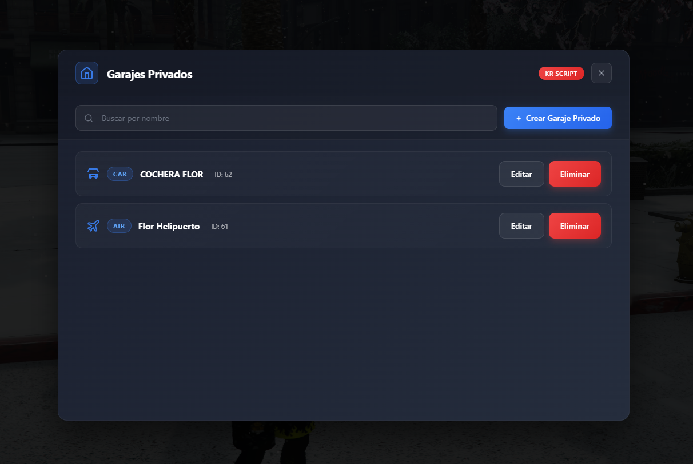
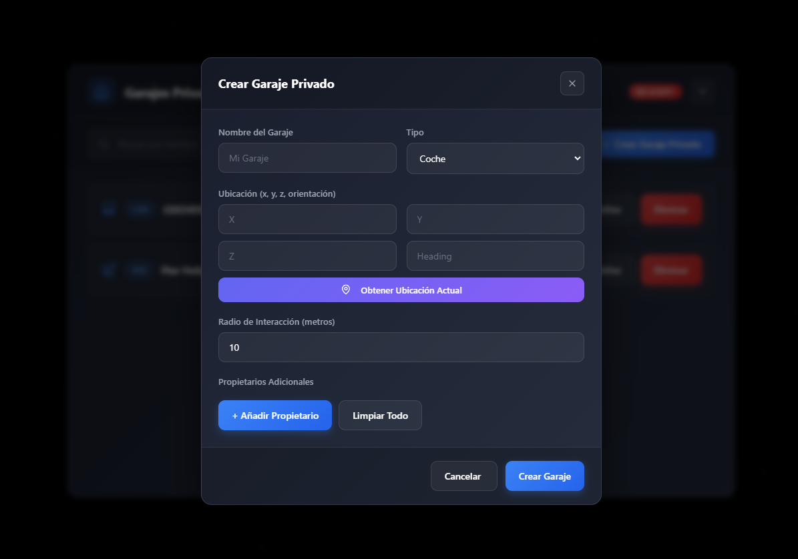
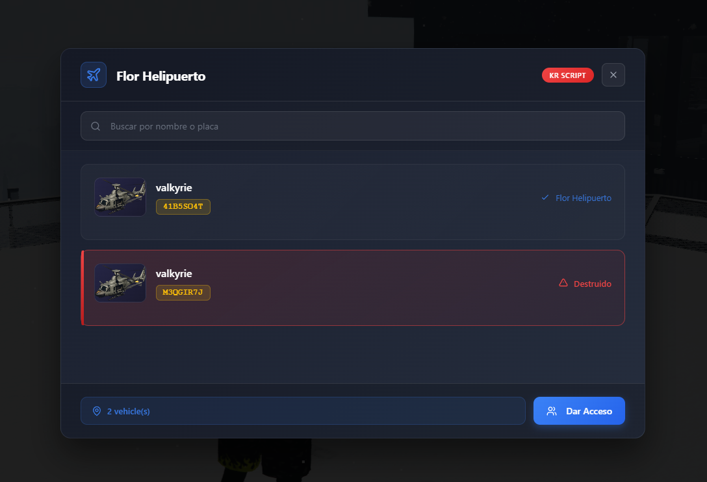
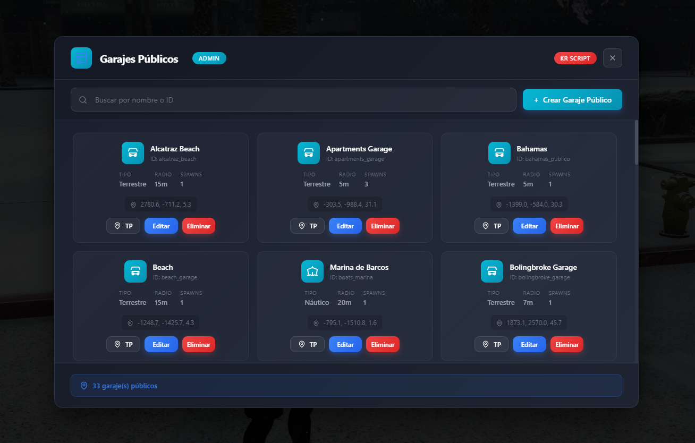
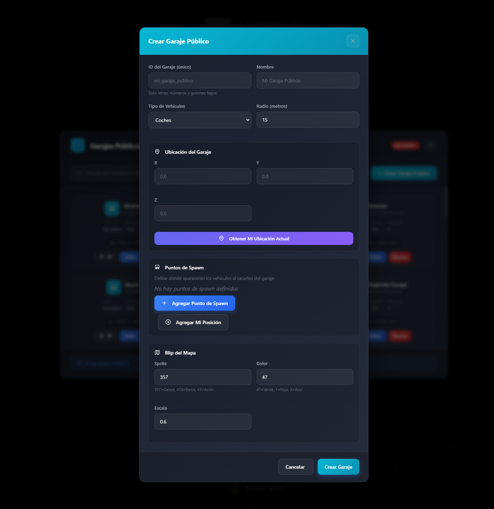
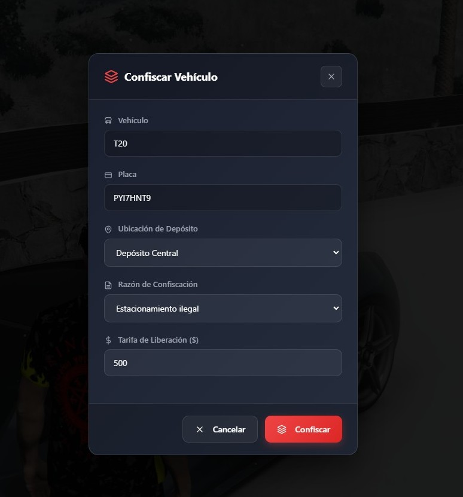
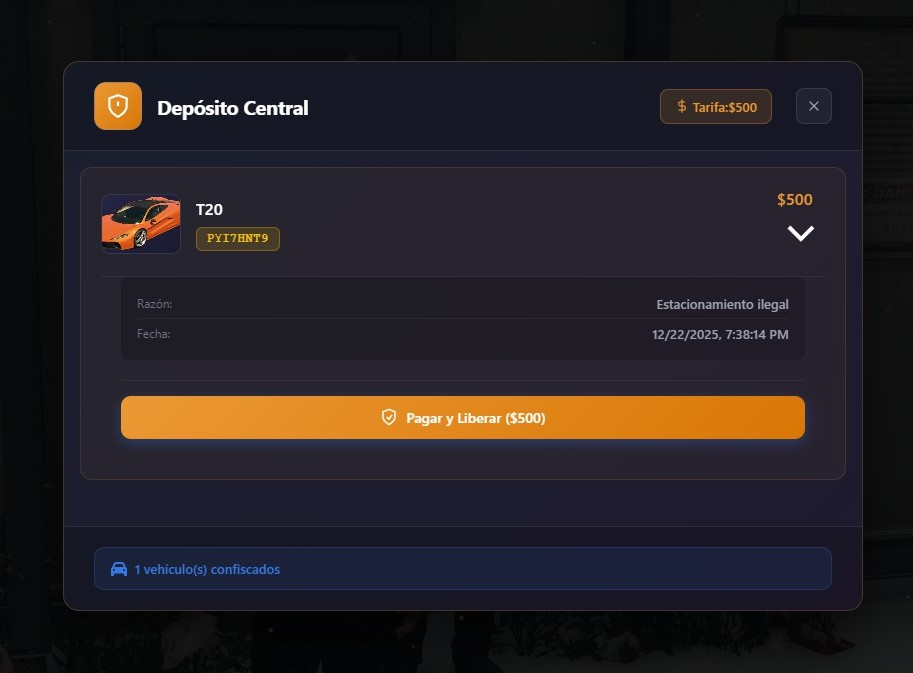

# KR Garages

Sistema de garajes para servidores FiveM compatible con ESX y QB-Core.


## Capturas de Pantalla

### Garajes Públicos

| Vista Principal | Tarjeta de Vehículo |
|-----------------|---------------------|
|  |  |

| Transferir Vehículo | Traer Vehículo |
|---------------------|----------------|
|  |  |

### Garajes Privados

| Panel Admin | Configuración |
|-------------|---------------|
|  |  |

| Helipuerto Privado |
|--------------------|
|  |

### Panel de Administración

| Garajes Públicos Admin | Configuración Admin |
|------------------------|---------------------|
|  |  |

### Sistema de Impound

| Menú Impound | Vista Previa | Barra de Progreso |
|--------------|--------------|-------------------|
|  |  |  |

## Características

- **Garajes Públicos y Privados** - Sistema completo de gestión de vehículos
- **Interfaz Moderna** - NUI con diseño limpio y responsive
- **Multi-Framework** - Funciona con ESX y QB-Core sin cambios
- **Sistema de Impound** - Confiscación y recuperación de vehículos
- **Tracking GPS** - Localiza tus vehículos en el mapa
- **Transferencia** - Transfiere vehículos a otros jugadores
- **Reparación** - Repara vehículos al sacarlos del garaje
- **Admin Panel** - Herramientas de administración integradas
- **Multi-idioma** - Soporte para ES, EN, DE, FR, IT, PL, PT, RU, TR

## Dependencias

- [oxmysql](https://github.com/overextended/oxmysql)
- [ox_target](https://github.com/overextended/ox_target) o [qb-target](https://github.com/qbcore-framework/qb-target)
- ESX o QB-Core

## Instalación

1. Descarga o clona este repositorio en tu carpeta `resources`
2. Ejecuta el SQL en `sql/setup.sql` en tu base de datos
3. Añade `ensure kr_garages` a tu `server.cfg`
4. Configura `config.lua` según tus necesidades
5. Reinicia el servidor

## Configuración

Edita `config.lua` para personalizar:

```lua
Config = {
    Framework = 'auto',        -- 'auto', 'esx' o 'qb'
    Target = 'ox_target',      -- 'ox_target' o 'qb-target'
    Locale = 'es',             -- Idioma
    DefaultGarageSlots = 10,   -- Espacios por defecto
    -- ... más opciones
}
```

## Comandos

| Comando | Descripción | Permisos |
|---------|-------------|----------|
| `/garagesadmin` | Panel de administración | Admin |
| `/gpublicoadmin` | Crear garaje público | Admin |
| `/recuperarvehs` | Recuperar vehículos huérfanos | Admin |
| `/cerrargaraje` | Cerrar/abrir un garaje | Admin |
| `/darauto [id] [modelo]` | Dar vehículo a jugador | Admin |
| `/confiscar` | Confiscar vehículo cercano | Policía |
| `/verimpound` | Ver vehículos en impound | Policía |

## Estructura

```
kr_garages/
├── client/          # Scripts del cliente
├── server/          # Scripts del servidor
├── shared/          # Datos compartidos
├── framework/       # Bridge ESX/QB
├── html/            # Interfaz NUI
│   ├── images/      # Imágenes de vehículos
│   └── locales/     # Archivos de idioma
├── sql/             # Scripts de base de datos
├── config.lua       # Configuración
└── fxmanifest.lua   # Manifest del recurso
```

## Base de Datos

El script usa las siguientes tablas:
- `public_garages` - Garajes públicos
- `private_garages` - Garajes privados
- `kr_impound` - Vehículos confiscados
- `owned_vehicles` - Vehículos de jugadores (existente)

## Licencia

Este proyecto está bajo la licencia GPL-3.0 (GNU General Public License v3.0).

Consulta el archivo `LICENSE` para el texto completo de la licencia o visita https://www.gnu.org/licenses/gpl-3.0.html.

## Autor

**King Red** - [@K1ngRed](https://github.com/K1ngRed)

---

Si te gusta el proyecto, dale una estrella!
